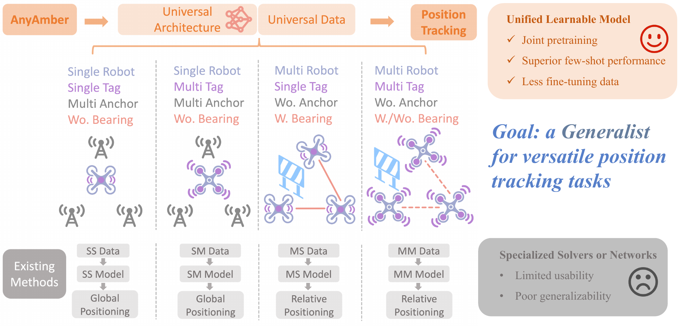
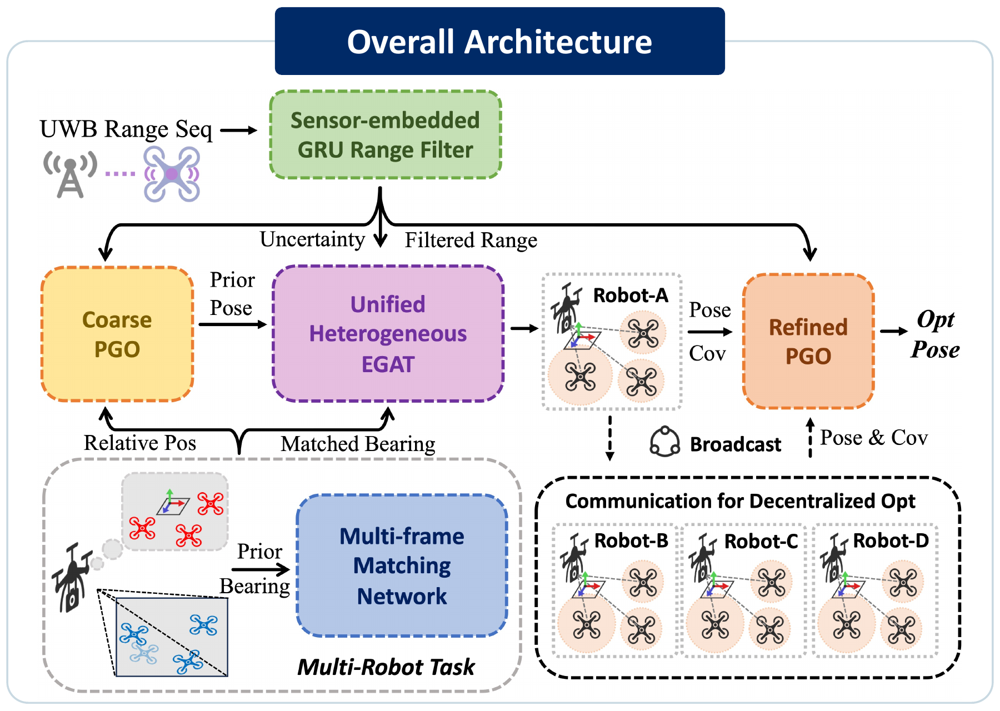
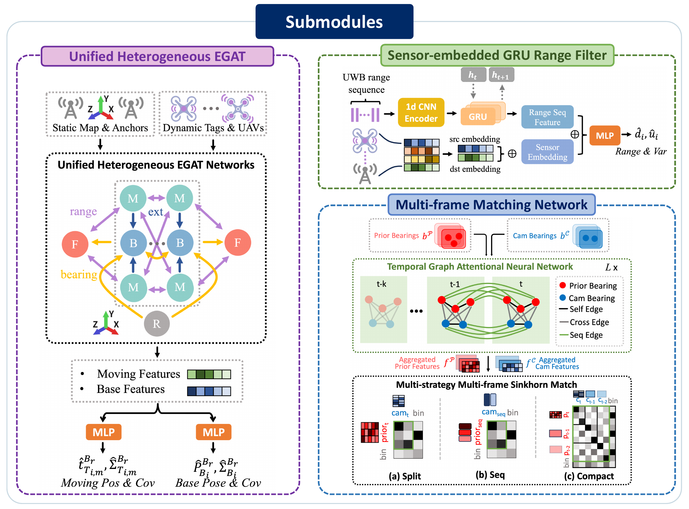
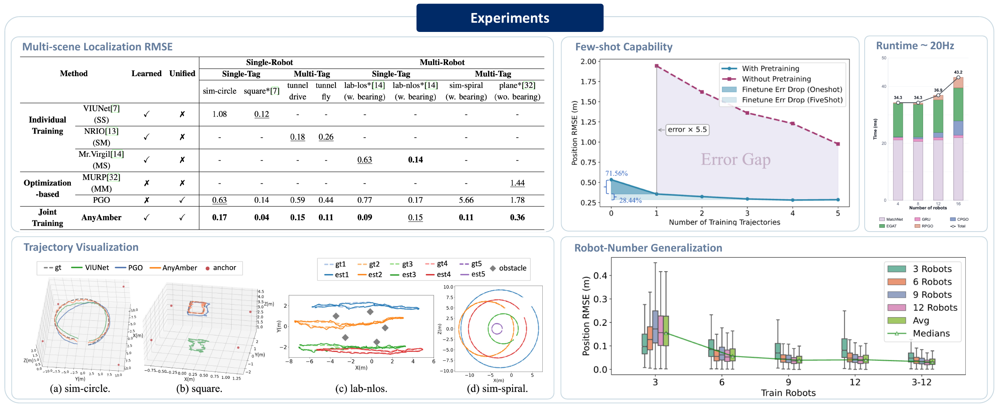

<div align="center">

# AnyAmber

### A Generalist for Versatile Anonymous Bearing and Range Based Position Tracking

**Si Wang<sup>1</sup>, Yanmei Jiao<sup>2</sup>, Yanjun Cao<sup>3</sup>, Rong Xiong<sup>1</sup>, Yue Wang<sup>1,&ast;</sup>**

<sup>1</sup>Institute of Cyber-Systems and Control, Zhejiang University<br>
<sup>2</sup>School of Information Science and Engineering, Hangzhou Normal University<br>
<sup>3</sup>Huzhou Institute of Zhejiang University<br>
<sup>&ast;</sup>Corresponding author

**Robotics: Science and Systems (RSS), 2026**

[Paper](./assets/AnyAmber.pdf)

</div>

<p align="center">
  <a href="./assets/teaser.png">
    
  </a>
</p>

## Overview

**AnyAmber is a generalist model for versatile anonymous bearing- and range-based position tracking.**

- **Unified formulation:** one model covers SS, SM, MS, and MM localization settings.
- **Generalist architecture:** one learnable network adapts to different numbers of robots, anchors, tags, and bearing observations.
- **Few-shot transfer:** joint pretraining enables adaptation to unseen scenes with only one fine-tuning trajectory.

## Architecture and Key Modules

<p align="center">
  <a href="./assets/architecture.png">
    
  </a>
  <a href="./assets/submodules.png">
    
  </a>
</p>

**Architecture:** a GRU filters UWB ranges, a temporal network matches anonymous bearings, heterogeneous EGAT predicts poses and uncertainty, and hierarchical PGO refines the result.

**Key modules:** heterogeneous EGAT unifies dynamic geometric graphs, the sensor-embedded GRU corrects UWB bias, multi-frame matching associates anonymous bearings, and differentiable PGO provides geometry-consistent refinement.

## Experiment Gallery

<p align="center">
  
</p>

**AnyAmber is trained and evaluated across simulated and real-world SS, SM, MS, and MM scenarios.**

## Experiments

<p align="center">
  <a href="./assets/experiments.png">
    
  </a>
</p>

- **Unified data:** **113 scenes, 317 trajectories, and 210,589 frames**, including **108 scenes and 153,555 frames** for joint pretraining.
- **Few-shot:** one trajectory of approximately **150 frames** is sufficient for scene adaptation.
- **Accurate:** **0.04-0.36 m RMSE** across eight unseen test scenarios.
- **Real-time:** at least **20 Hz** when scaling from 4 to 16 robots.

## Code Usage

### Dependencies

AnyAmber is implemented in Python with PyTorch. The main dependencies used by the codebase are:

- PyTorch, DGL, PyTorch3D, and Theseus;
- NumPy, SciPy, pandas, scikit-learn, NetworkX, and transforms3d;
- PyYAML when loading YAML configuration files.

Install mutually compatible versions for your CUDA and PyTorch environment before running the entry points.

### Data and Checkpoint Paths

The default filenames expected under `--model_file` are:

```text
checkpoints/
├── uni.pt          # Unified EGAT
├── match-pos.pt    # Multi-frame matching network
└── rf-embed.pt     # Sensor-embedded range filter
```

Datasets are loaded from `--train_dataset` and `--val_dataset`. Both dataset and checkpoint locations can also be supplied through a JSON or YAML file using `--config`; explicit command-line values take precedence. The complete dataset is currently being organized and will be released in this repository shortly.

### Training

Train the unified EGAT localization model:

```bash
python train_egat.py \
  --train_dataset /path/to/train/data \
  --val_dataset /path/to/validation/data \
  --model_file /path/to/checkpoints \
  --device cuda
```

The matching and range-filter modules use the same shared arguments:

```bash
python train_match.py --train_dataset /path/to/train/data --val_dataset /path/to/validation/data
python train_range_filter.py --train_dataset /path/to/train/data --val_dataset /path/to/validation/data
```

### Evaluation and Inference

Evaluate a pretrained EGAT model:

```bash
python eval.py \
  --task egat \
  --val_dataset /path/to/test/data \
  --model_file /path/to/checkpoints \
  --load_pretrained_model true \
  --device cuda
```

Run inference and optionally write the predicted trajectory:

```bash
python infer.py \
  --task egat \
  --val_dataset /path/to/test/data \
  --model_file /path/to/checkpoints \
  --wrt_traj true \
  --device cuda
```

Evaluation supports `match`, `range`, `egat`, and `end2end` tasks. Inference supports `match`, `egat`, and `end2end` tasks.

### Repository Structure

- `model/`: heterogeneous EGAT, matching networks, and range-filter modules.
- `runners/`: task-specific training, evaluation, and inference loops.
- `pgo/`: differentiable single-robot and multi-robot pose graph optimization.
- `util/`: graph construction, dataset processing, geometry, losses, metrics, and recording utilities.
- `train_*.py`: component-specific training entry points.
- `eval.py` and `infer.py`: unified task dispatch for evaluation and inference.

## License

This project is released under the [MIT License](./LICENSE).
